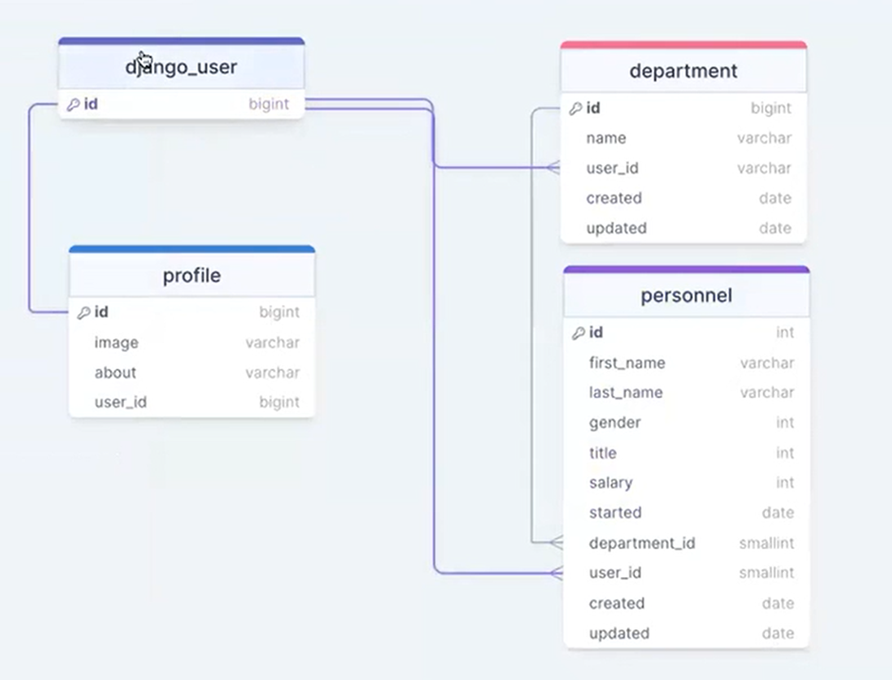

# Personnel App

PersonnelApp is a Django_REST_Framework-based application for managing personnel data in an organization.

## Features

- Create, update, and delete personnel records
- Assign personnel to departments
- View personnel details, including name, gender, salary, start date, and title
- Secure authentication and authorization
- RESTful API endpoints for integration with other systems

## Installation

1. Clone the repository:

```
git clone https://github.com/omer-fsdev/personnelApp_DjangoREST.git
```

2. Create a virtual environment and activate it:

```
   python -m venv env
   source env/bin/activate  # Linux/Mac
   .\env\Scripts\activate  # Windows
```

3. Install dependencies:

```

pip install -r requirements.txt

```

4. Apply database migrations:

```
python manage.py migrate

```

5. Run the development server:

```
python manage.py runserver

```

6.  Access the API documentation at http://localhost:8000/swagger/ or http://localhost:8000/redoc/.

## Usage

1. Create a superuser account:

```
python manage.py createsuperuser

```

2. Log in to the PersonnelApp administration panel at http://localhost:8000/admin using the superuser credentials.
3. Create departments and personnel records through the administration panel or via the API endpoints.

## Project ER-Diagram



## Contributing

Contributions are welcome! If you find any issues or have suggestions for improvement, please create an issue or submit a pull request.

## License

This project is licensed under the MIT License.
